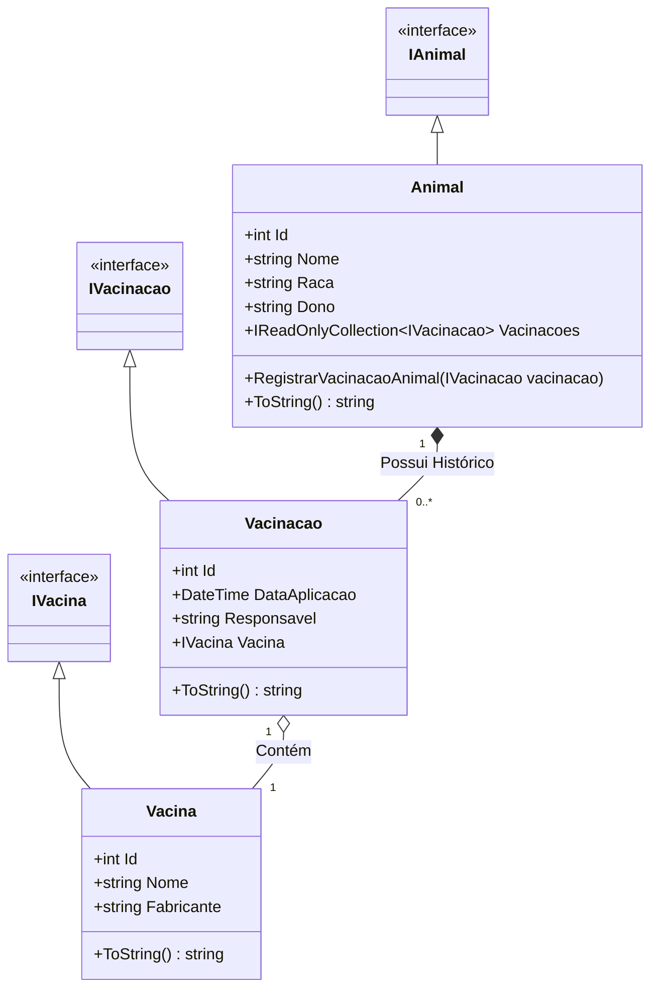
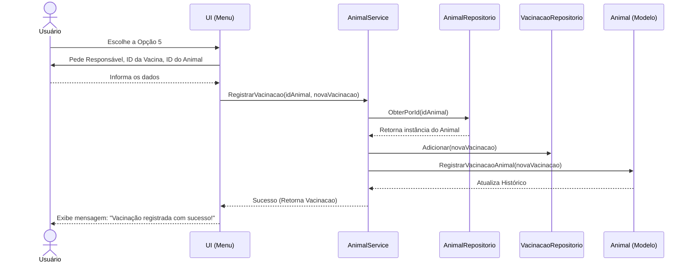

# 🐾 Sistema PetVacinas - C# .NET

Um sistema de gerenciamento veterinário completo e robusto desenvolvido em C# utilizando os princípios da Programação Orientada a Objetos (POO). O projeto simula o dia a dia de uma clínica ou pet shop do mundo real, incluindo cadastro de animais, gestão de catálogo de vacinas, registro de histórico de vacinações aplicadas e testes unitários automatizados.

## 🛠️ Tecnologias Utilizadas

* **C#** (Linguagem de programação principal)
* **.NET SDK** (Plataforma e ecossistema de desenvolvimento)
* **xUnit** (Framework utilizado para a criação dos testes unitários)

## 🗂️ Estrutura do Projeto

A solução é dividida em três projetos principais, seguindo boas práticas de modularização e separação de responsabilidades (Arquitetura Limpa):

```text
PetVacinas/
│
├── 📂 PetVacinas.Core/
│   ├── 📂 Models/
|   |    ├── 📄 Animal.cs
|   |    ├── 📄 Vacina.cs
|   |    └── 📄 ...
│   ├── 📂 Interfaces/
|   |    ├── 📄 IAnimal.cs
|   |    ├── 📄 IAnimalService.cs
|   |    └── 📄 ...
│   └── 📂 Services/
|        ├── 📄 AnimalService.cs
|        └── 📄 VacinaService.cs
│
├── 📂 PetVacinas.ConsoleApp/
│   ├── 📂 UI/
|   |    └── 📄 Menu.cs
│   └── 📄 Program.cs
│
└── 📂 PetVacinas.Tests/
     └── 📄 AnimalTests.cs
```

* **`PetVacinas.Core/`**: A biblioteca de classes (Class Library) principal contendo as regras e o domínio do negócio.
  * `Models/`: Contém as entidades centrais do sistema (`Animal`, `Vacina`, `Vacinacao`).
  * `Interfaces/`: Contém os contratos (abstrações) que garantem o baixo acoplamento entre as classes.
  * `Services/`: Contém a lógica de orquestração e regras de negócio (`AnimalService`, `VacinaService`).
* **`PetVacinas.ConsoleApp/`**: Uma aplicação de console (Console App) com o `Program.cs` e a classe `Menu.cs`. Ela serve como interface prática de uso do sistema, recebendo interações do usuário, validando entradas e exibindo as informações na tela.
* **`PetVacinas.Tests/`**: Projeto de testes unitários utilizando o framework **xUnit**, que garante a integridade de todas as regras de negócio como cadastros, busca por IDs e validações de exceção.

## 📊 Diagrama de Classes (UML)

Abaixo está o diagrama UML que representa a estrutura principal do domínio do projeto:




## 🧩 Classes e Modelos Principais

- **`Animal`:** Representa o pet no sistema. Contém propriedades fundamentais (Nome, Raça, Dono) e gerencia internamente uma pilha (`Stack<IVacinacao>`) com o histórico de vacinas, expondo-a de forma segura através de uma `IReadOnlyCollection`.
- **`Vacina`:** O catálogo base de vacinas do sistema (ex: Antirrábica, Multipla). Define o nome e o fabricante da substância.
- **`Vacinacao`:** É o evento (ato) de vacinar. Armazena *quando* ocorreu (DataAplicacao), *quem* aplicou (Responsavel) e *qual* vacina (`IVacina`) foi administrada no animal.
- **`AnimalService / VacinaService`:** Orquestram as regras de negócio, comunicando-se com as camadas de persistência (`Repositorios`) para criar, recuperar e atrelar os dados.
- **`Menu`:** Controla todo o ciclo de vida visual e interativo do sistema, garantindo entradas de dados seguras (`ReceberInteiro`, `ValidarOpcao`).


## 🔄 Diagramas de Sequência

### Fluxo de Registro de Vacinação em um Animal



## ⚠️ Tratamento de Exceções

A aplicação foi desenhada para nunca "quebrar" ou fechar abruptamente na tela do usuário caso ele cometa um erro ou uma regra de negócio seja violada.

1. **Domain Exceptions (Core):**
   - `ArgumentNullException` / `ArgumentException`: Lançados nos modelos (`Animal`, `Vacina`, `Vacinacao`) caso o usuário tente cadastrar entidades com campos obrigatórios nulos ou vazios.
   - `KeyNotFoundException`: Lançado pelas camadas de Serviço/Repositório ao tentar buscar um ID de animal ou vacina inexistente.
   - `InvalidOperationException`: Lançado em lógicas de estado inconsistente (ex: obter dados de listas totalmente vazias).

2. **Graceful Handling (UI):**
   No método `VerificarOpcao` da classe `Menu`, há um bloco `try / catch (Exception ex)` em volta de todo o `switch`. Isso garante que qualquer erro de regra de negócio lançado no Core seja capturado na UI, exibindo de forma elegante:
   `[ERRO] Ação não concluída: {ex.Message}`

## 🌟 Boas Práticas Aplicadas

- **Encapsulamento Rico:** O histórico de vacinações de um `Animal` é armazenado como uma `Stack<T>` privada, mas exposto como `IReadOnlyCollection<T>`. Ninguém de fora pode adicionar itens na lista sem passar pelo método controlado `RegistrarVacinacaoAnimal`.
- **Programação Orientada a Interfaces:** A UI e os serviços não dependem de implementações concretas (`Vacina`), mas sim das interfaces abstratas (`IVacina`).
- **Fail-Fast:** Validadores (como as entradas numéricas em `Menu.ReceberInteiro`) travam o usuário em um `while` seguro utilizando `.TryParse`, inviabilizando que dados espúrios cheguem no núcleo do sistema.
- **Arquitetura em Camadas:** A camada de domínio (Core) não sabe que existe um console. Ela funcionaria da mesma maneira caso fosse anexada a uma API Web ou aplicação Mobile.


## ✅ Testes Unitários

O sistema possui cobertura robusta de testes utilizando **xUnit**. Todos os testes foram redigidos utilizando o padrão **AAA** (Arrange, Act, Assert).

- **Sucessos garantidos:**
  - Criação correta de Animais e Vacinas.
  - Registro e atrelamento de múltiplas vacinas a um histórico de animal único.
  - Buscas consistentes por IDs válidos.

- **Prevenção de Falhas testadas:**
  - Validação de regras contra Nullables (`ArgumentNullException`).
  - Lançamento correto de exceções para regras de domínio e acessos a dados fantasmas (`KeyNotFoundException`).

Para rodar os testes localmente:
```bash
dotnet test
```


## 🚀 Como Executar o Projeto

### Pré-requisitos
- .NET SDK instalado na sua máquina.

### Passos

1. Clone este repositório para a sua máquina local:
   ```bash
   git clone https://github.com/SeuUsuario/PetVacinas.git
   ```
2. Navegue até o diretório raiz do projeto:
   ```bash
   cd PetVacinas
   ```
3. Restaure as dependências:
   ```bash
   dotnet restore
   ```
4. Execute o ConsoleApp:
   ```bash
   dotnet run --project PetVacinas.ConsoleApp
   ```

   ```
   *Você verá a validação das regras de negócio atestadas como "Passed".*


## 🖥️ Demonstração de Uso

Exemplo de uma interação real com o console ao rodar o aplicativo e cadastrar um animal:

```text
=============  MENU PET-VACINAS  =============
1 - Cadastrar animal
2 - Listar todos os animais
3 - Cadastrar vacina
4 - Listar todas as vacinas
5 - Registrar vacinação em um animal
6 - Exibir histórico de vacinações de um animal
7 - Sair
Escolha uma opção: 1

Informações do animal: 
Nome do animal: Rex
Raça do animal: Golden Retriever
Dono do animal: João
Rex foi cadastrado (a) com sucesso!

Pressione qualquer tecla para continuar...
```

## 📌 Considerações e Próximos Passos

Este projeto está em evolução. Como sugestões de melhoria arquitetural (Roadmap):

1. **Injeção de Dependência (DI):** Refatorar `AnimalService` e `VacinaService` para receberem seus respectivos repositórios via construtor, ao invés de instanciá-los internamente. Isso permitirá "Mocks" isolados em testes avançados.
2. **Persistência de Dados (Banco de Dados):** Substituir as listas em memória das classes de `Repositorio` por Entity Framework Core integrado com bancos como SQL Server ou SQLite.
3. **Geração de IDs:** Mover a responsabilidade de criação e incremento de `Ids` dos modelos (onde usam estáticos) para a camada de infraestrutura/repositórios.


## 📝 Licença

Este projeto está licenciado sob os termos da licença **MIT**. Você é livre para utilizar, modificar e distribuir o código conforme necessário.

---

<div align="center">
  
  **Obrigado pela visita!**  
  [Kenzo Friás](https://www.github.com/kenzofrias) © 2026
  
</div>
